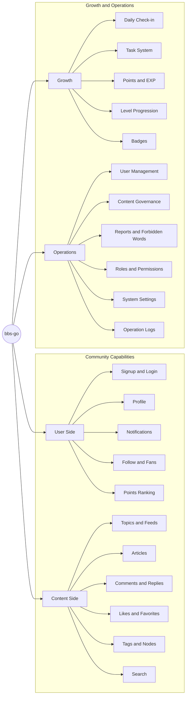

# bbs-go (UniverseEmbedded fork)

[English](README.en-US.md) | [中文](README.md)

**Do Not Fork Gentle Into That Private Repo**

Do not fork gentle into that private repo,

Old code should burn and merge at close of day;

Rage, rage against the dying of the open.

Though wise devs at their end know closed is wrong,

Because their repos had starred no lightning they

Do not fork gentle into that private repo.

Good devs, the last wave by, crying how bright

Their frail features might have danced in a green branch,

Rage, rage against the dying of the open.

Wild devs who caught and sang the sun in flight,

And learn, in joy, they shared it on its way,

Do not fork gentle into that private repo.

Grave suits, near IPO, who see with blinding sight

Blind patents could blaze like meteors and be free,

Rage, rage against the dying of the open.

And you, my founder, there on the sad height,

Curse, bless, me now with your fierce merge, I pray.

Do not fork gentle into that private repo.

Rage, rage against the dying of the open.

This repository is a downstream fork of `mlogclub/bbs-go`. The goal is to keep the frontend source (site + admin) buildable and reviewable while continuing backend evolution, so we can fix bugs and develop new features as needed.

## Notice: Frontend Source Replacement Point (History)

In the history of the `master` branch, the frontend once shifted from “source project form” to “built-assets form” (only keeping outputs such as `site/_nuxt` and `admin/assets` in the repo).

- Baseline commit (frontend source projects still present): https://github.com/UniverseEmbedded/bbs-go/commit/fe26ad02a078db61389a3bc7d3b3cdbae0461fb5
  - This commit still contains `site/package.json`, `site/nuxt.config.ts`, `admin/package.json`, and other source-project entry files.
- Replacement commit (removes source entries, commits built assets): https://github.com/UniverseEmbedded/bbs-go/commit/509461d2ccb23960876098be2473117c5402271f
  - This commit deletes `site/package.json`, `site/nuxt.config.ts`, `admin/package.json`, and adds/updates built outputs like `site/_nuxt/*` and `admin/assets/*`.

The policy of this fork: keep frontend maintained as source; built assets are optional release artifacts, not a replacement for source.

## Links

- This fork: https://github.com/UniverseEmbedded/bbs-go
- Upstream: https://github.com/mlogclub/bbs-go
- Upstream website/community (reference): https://bbs-go.com / https://bbs.bbs-go.com

## Why Choose bbs-go

- **Ready out of the box**: Core community capabilities including signup/login, posting, commenting, likes, favorites, follows, and notifications.
- **Growth loop built-in**: Tasks, points, levels, and badges to improve user activity and retention.
- **Operations friendly**: Content governance, user governance, permission governance, and system settings for long-term operations.
- **Bilingual support**: Built-in `en-US` and `zh-CN` for multilingual community scenarios.

## Feature Map

## Core Features

### User Side

- Account registration and login (multiple login methods supported)
- User profile management and personal homepage
- Follow/fan relationship management
- In-site notifications and interaction reminders
- Point records and leaderboards

### Content Side

- Publish and edit topics, feeds, and articles
- Complete interaction loop with comments, replies, likes, and favorites
- Tags and nodes for better content organization and discovery
- Interactive features like voting and hidden content
- In-site search for faster content retrieval

### Growth Side

- Daily check-in for ongoing activity incentives
- Task system (new user, daily, achievement)
- Points and EXP reward mechanisms
- Level progression configuration
- Badge and honor system

### Operations Side

- Unified governance for users, topics, comments, and articles
- Report handling and forbidden-word management
- Role, menu, and API permission management
- System parameter and site configuration management
- Operation logs and audit trails

## Typical Use Cases

- Developer and technical communities
- Hobby and interest-based communities
- Product user communities
- Internal enterprise knowledge communities
- Content membership communities

## Contact

QQ Group：589219461

Github：<https://github.com/pama1234>

## What Is bbs-go

`bbs-go` is an open-source community system that helps you quickly build an operable and growth-oriented content community.

In one sentence: **Publish easily, engage deeply, govern effectively, and grow continuously.**

