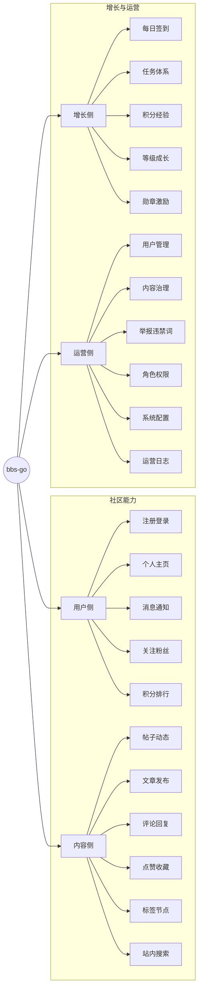

# bbs-go（UniverseEmbedded fork）

[中文](README.md) | [English](README.en-US.md)

**不要温和地Fork到那个私有存储库**

不要温和地Fork到那个私有存储库，  
旧代码应当在日暮时燃烧合并；  
怒斥，怒斥开源的消逝。

虽然智者临终时懂得闭源有误，  
因为他们的仓库从未被打上星标，  
不要温和地Fork那个私仓。

善良的开发者，最后一浪过去，高呼多么明亮  
他们微小的功能本可以在主分支里起舞，  
怒斥，怒斥开源的消逝。

狂野的人抓取并歌颂飞逝的提交，  
并且及时领悟，他们在路上分享了它，  
不要温和地Fork那个私仓。

严肃的公司，临近上市，用盲眼看见  
盲目的专利可以像流星一样闪耀而自由，  
怒斥，怒斥开源的消逝。

而你，我的创始人，在那悲伤的估值之巅，  
现在用你激烈的合并请求诅咒我，祝福我吧，我祈求。  
不要温和地Fork那个私仓。  
怒斥，怒斥开源的消逝。

本仓库是 `mlogclub/bbs-go` 的下游 fork，用于在继续演进后端的同时，维护可构建、可审阅的前端源码（site + admin），以便持续修 bug 与按需开发新功能。

## 重要说明：前端源码替换点（历史提交）

在 `master` 分支的历史中，前端曾在一次大版本提交中从“源码工程形态”被替换为“构建产物形态”（仓库中仅保留 `site/_nuxt`、`admin/assets` 等打包结果）。

- 基准提交（仍包含前端源码工程）：https://github.com/UniverseEmbedded/bbs-go/commit/fe26ad02a078db61389a3bc7d3b3cdbae0461fb5
  - 该提交仍包含 `site/package.json`、`site/nuxt.config.ts`、`admin/package.json` 等源码工程入口文件。
- 替换提交（删除源码工程入口，提交打包产物）：https://github.com/UniverseEmbedded/bbs-go/commit/509461d2ccb23960876098be2473117c5402271f
  - 该提交删除 `site/package.json`、`site/nuxt.config.ts`、`admin/package.json`，并新增/更新 `site/_nuxt/*`、`admin/assets/*` 等构建产物。

本仓库的策略是：前端以源码形态持续维护，构建产物仅作为可选发布物，不作为“替换源码”的唯一形态。

## 链接

- 当前仓库（本 fork）：https://github.com/UniverseEmbedded/bbs-go
- 上游仓库（原始来源）：https://github.com/mlogclub/bbs-go
- 上游官网与社区（参考）：https://bbs-go.com / https://bbs.bbs-go.com

## 为什么选择 bbs-go

- **开箱可用**：注册登录、发帖评论、点赞收藏、关注消息等核心社区能力可直接使用。
- **增长闭环**：内置任务、积分、等级、勋章，支持用户活跃和长期留存。
- **运营友好**：提供内容治理、用户治理、权限治理与系统配置能力，方便持续运营。
- **双语支持**：内置 `en-US` / `zh-CN`，适合面向不同语言用户的社区场景。

## 功能地图

## 核心功能

### 用户侧

- 账号注册与登录（支持多种登录方式）
- 用户资料维护与个人主页展示
- 关注/粉丝关系管理
- 站内消息与互动提醒
- 积分记录与排行榜

### 内容侧

- 支持帖子、动态、文章发布与编辑
- 评论、回复、点赞、收藏等完整互动链路
- 标签与节点管理，便于内容组织和发现
- 支持投票、隐藏内容等互动玩法
- 站内搜索能力，提升内容检索效率

### 增长侧

- 每日签到，持续活跃激励
- 任务体系（新手、每日、成就）
- 积分与经验奖励机制
- 等级成长配置
- 勋章与荣誉体系

### 运营侧

- 用户、帖子、评论、文章等统一治理
- 举报处理与违禁词管理
- 角色、菜单、接口权限分配
- 系统参数与站点配置管理
- 运营日志与行为留痕

## 适用场景

- 技术交流社区
- 兴趣爱好社群
- 产品用户社区
- 企业内部知识社区
- 内容型会员社区

## 联系我

QQ群：589219461

Github：<https://github.com/pama1234>

## bbs-go 是什么

`bbs-go` 是一个开源社区系统，帮助你快速搭建可运营、可增长的内容社区。

一句话概括：**发得出来、聊得起来、管得住、长得快**。
